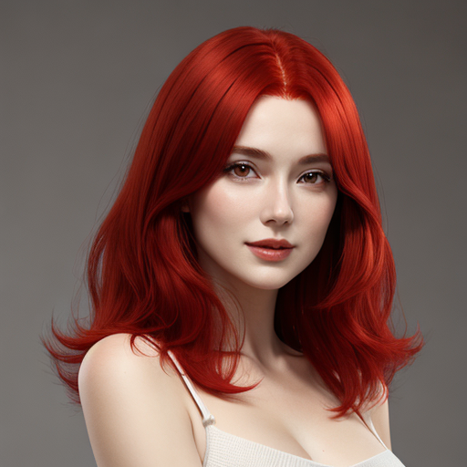

# Ai Image Generator

Some Python applications that demonstrate how to generate or manage images using Artificial Intelligence (Ai).

## Results - TXT TO IMG

<a href="output-txt2img.png" target="_blank" rel="noopener noreferrer">
    
</a>

## Results - IMG TO IMG

<a href="output-img2img.png" target="_blank" rel="noopener noreferrer">
    
</a>

## Results - UPSCALE

<a href="output-upscale.png" target="_blank" rel="noopener noreferrer">
    
</a>

## Results - RMBG

<a href="output-rmbg.png" target="_blank" rel="noopener noreferrer">
    
</a>

## How to clear Hugging Face cache

Execute on terminal:

```bash
rm -rf ~/.cache/huggingface/
```

## Buy me a coffee

<a href='https://ko-fi.com/paulocoutinho' target='_blank'></a>

## License

[MIT](http://opensource.org/licenses/MIT)

Copyright (c) 2024, Paulo Coutinho
